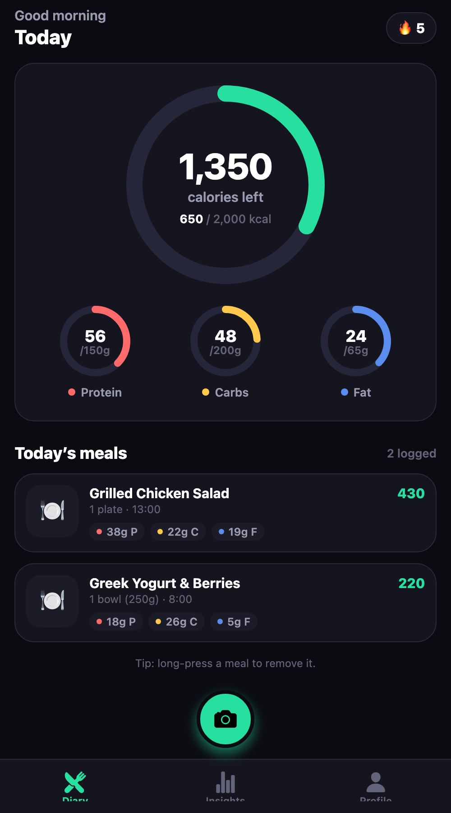
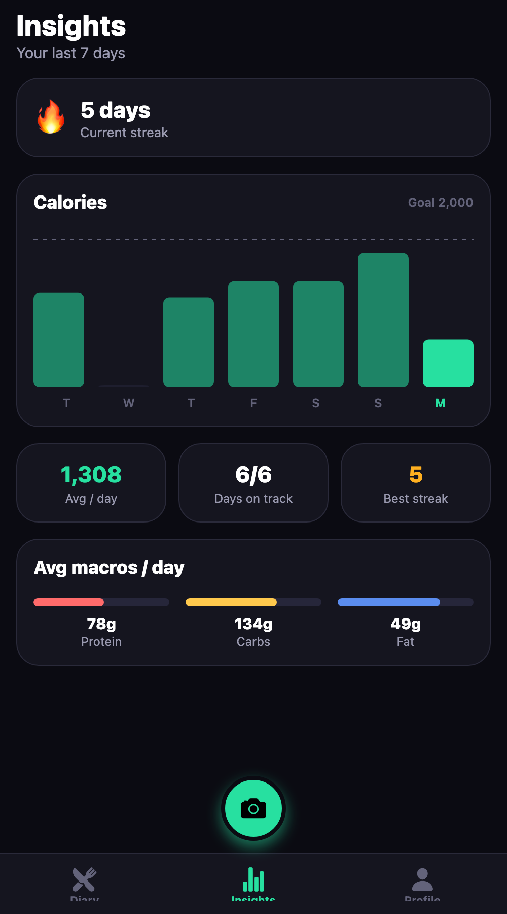
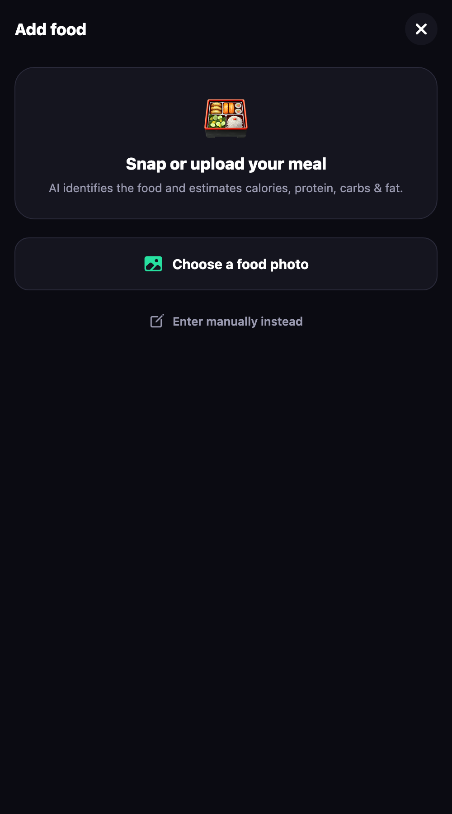
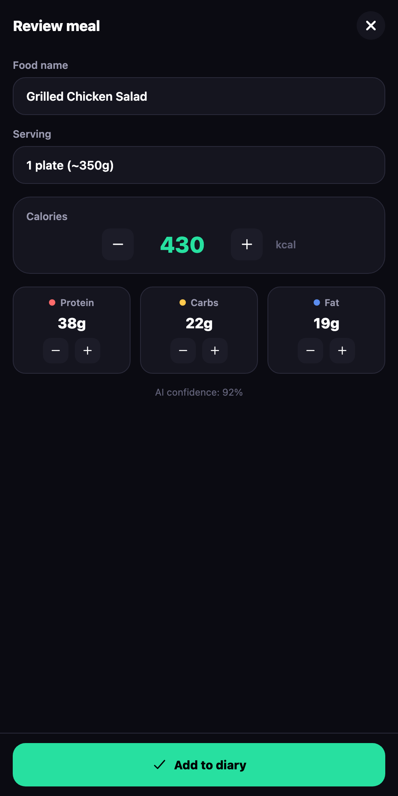
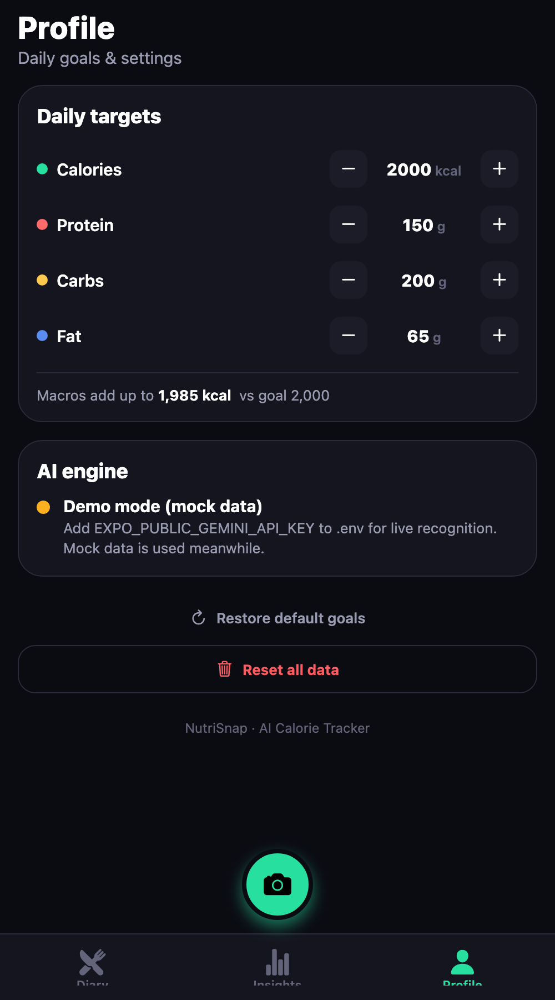

# 🥗 NutriSnap — AI Calorie Tracker

Snap a photo of any meal and instantly get calories, macros, and a full nutritional
breakdown powered by AI. NutriSnap is a Cal AI–style calorie tracker built with
**React Native + Expo**, with a polished daily diary, macro progress rings, weekly
history charts, and streak tracking.

> Built for the *Cal AI Clone* challenge. Runs as a web app (and on iOS/Android via Expo).

## ✨ Features

- 📷 **AI food recognition** — photograph or upload a meal; Google **Gemini Vision** identifies the dish and estimates calories + protein/carbs/fat.
- ✍️ **Review & edit** — every AI result is fully editable before saving (name, serving, calories, macros) with an AI-confidence indicator.
- 📔 **Daily diary** — running calorie total with a hero **calorie ring** and per-meal cards.
- 🎯 **Macro progress rings** — protein, carbs and fat each get an SVG ring vs. your goal.
- 📊 **Weekly insights** — 7-day calorie bar chart with a goal line, daily average, days-on-track, and average macros.
- 🔥 **Streak tracking** — consecutive days with a logged meal, plus your best streak.
- ⚙️ **Editable goals** — set calorie & macro targets on the Profile tab (sensible defaults out of the box).
- 💾 **Offline-first** — everything persists locally (AsyncStorage / localStorage). Works with **zero backend**.
- 🧪 **Graceful fallback** — no API key? The app runs in demo mode with realistic mock results, so it never breaks.

## 📸 Screenshots

| Diary | Insights | Add (AI) | Review | Profile |
|---|---|---|---|---|
|  |  |  |  |  |

## 🚀 Getting started

```bash
npm install
npm run web        # opens the app in your browser (or: npx expo start)
```

Then press `w` for web, `i` for iOS simulator, or scan the QR code with **Expo Go**.

### Enable real AI

The app works immediately in **demo mode**. To turn on live recognition, pick **one**
provider — copy `.env.example` → `.env`, fill in a key, then restart with `npx expo start -c`
(env vars are baked in at bundle time). The Profile tab shows the active engine.

**Claude (Anthropic):**
```
EXPO_PUBLIC_ANTHROPIC_API_KEY=sk-ant-...      # console.anthropic.com/settings/keys
# EXPO_PUBLIC_CLAUDE_MODEL=claude-opus-4-8    # optional: more capable than the default haiku
```

**Gemini (free):**
```
EXPO_PUBLIC_GEMINI_API_KEY=AIza...            # aistudio.google.com/apikey
```

**NVIDIA NIM (free dev credits):**
```
EXPO_PUBLIC_NVIDIA_API_KEY=nvapi-...          # build.nvidia.com (pick a "Free Endpoint" multimodal model)
# EXPO_PUBLIC_NVIDIA_MODEL=meta/llama-4-maverick-17b-128e-instruct   # optional
```
> NVIDIA's API blocks direct browser calls (no CORS). **On web**, run the bundled proxy in a
> second terminal — it holds the key server-side and adds CORS:
> ```
> npm run nvidia-proxy      # keep running alongside `npx expo start`
> ```
> On a **phone via Expo Go**, no proxy is needed (native calls aren't subject to CORS).

Auto-picks **Claude → Gemini → NVIDIA → mock**; force one with `EXPO_PUBLIC_AI_PROVIDER=claude|gemini|nvidia|mock`.

## 🧠 AI integration

Food recognition is a **pluggable provider** behind a single service (`src/services/ai.ts`),
so the UI never talks to a model directly:

- **`claude.ts`** — official `@anthropic-ai/sdk` (`claude-haiku-4-5` by default) with a vision
  image block, **structured outputs** (`output_config.format` + JSON schema) to force a typed
  `{ name, servingDesc, calories, protein, carbs, fat, confidence }` result, and **prompt
  caching** (`cache_control`) on the system prompt. Runs in Expo web via `dangerouslyAllowBrowser`;
  the SDK auto-retries 429/5xx.
- **`gemini.ts`** — `gemini-2.0-flash` via REST with `responseSchema` structured output and a
  manual 429/503 backoff retry.
- **`nvidia.ts`** — NVIDIA NIM (OpenAI-compatible REST, Llama 4 Maverick multimodal by default). Downscales
  the photo with `expo-image-manipulator` to fit NVIDIA's inline-image limit, then parses the
  JSON from the reply with a fence-tolerant extractor.
- **`sanitize.ts`** — one shared prompt + schema + sanitizer for both providers: numbers are
  clamped to sane ranges, and if the model's calorie figure disagrees badly with its own macros,
  it's recomputed from macros (4/4/9 kcal/g).
- **`ai.ts`** — auto-selects **Claude → Gemini → mock**, and **falls back to mock on any
  network/parse error** so the demo never dead-ends.

> **Security note:** keys are read from `EXPO_PUBLIC_*` env vars and calls are made client-side.
> Fine for a demo; the production fix is a thin server proxy that holds the key. Documented in
> `claude.ts` / `gemini.ts`.

## 🏗️ Architecture

```
src/
  app/                      # Expo Router (file-based routing)
    _layout.tsx             # root stack (tabs + add modal), dark theme
    (tabs)/
      _layout.tsx           # bottom tabs + center "scan" FAB
      index.tsx             # Diary: calorie ring, macro rings, today's meals
      insights.tsx          # weekly chart, stats, streak
      profile.tsx           # editable goals + AI status
    add.tsx                 # pick → analyze → review → save (modal)
  components/                # CalorieRing, MacroRings, ProgressRing, MealCard,
                             # WeeklyBarChart, StreakBadge, Card, Screen, EmptyState
  services/                  # ai.ts (router), claude.ts, gemini.ts, nvidia.ts, sanitize.ts, mockAnalyzer.ts
  store/                     # useDiaryStore.ts (zustand + persist), seed.ts
  lib/                       # nutrition.ts, streak.ts, date.ts, types.ts (pure logic)
  theme/                     # colors, spacing, radius, fonts
```

Principles: **pure logic in `lib/`** (totals, streaks, dates — easy to read/test),
a **single AI source of truth** in `services/`, and **one reusable SVG ring** primitive
that powers both the calorie ring and the three macro rings.

## 🛠️ Tech stack

React Native · Expo (SDK 56) · Expo Router · TypeScript · Zustand · AsyncStorage ·
react-native-svg · expo-image-picker · Anthropic Claude (`@anthropic-ai/sdk`) · Google Gemini Vision.

## 🤔 Reflection

**What was easy.** Expo + Expo Router made the multi-screen structure quick to stand up,
and Gemini's structured-output mode meant the AI returned clean typed JSON instead of prose
to parse. Keeping all nutrition math as pure functions let the diary, rings, and charts share
one source of truth.

**What was tricky.** Two web-specific gotchas: (1) Expo's default **static web rendering**
prerenders in Node, where `window`/`localStorage` don't exist — switching `web.output` to
`single` (SPA) fixed it. (2) Animating SVG `strokeDashoffset` via React Native's `Animated`
is unreliable on `react-native-web`, so the progress rings render their arc from real React
state instead. Getting a responsive, centered layout right across phone and desktop widths
also took iteration.

**What I'd change with more time.** Add a server proxy for the API key, multi-item detection
per photo, a barcode / manual-search database for packaged foods, and per-meal grouping
(breakfast / lunch / dinner). I'd also add unit tests around `lib/streak.ts` and `lib/nutrition.ts`.

## 📁 AI logs

The `/ai-logs` folder contains the Claude Code conversation used to build this app.
Re-sync with `bash scripts/sync-ai-logs.sh`.
